# NIDS-Triage-Lab

This Lab demonstrates end-to-end proficiency in Network Security Monitoring and Incident Triage. The core objective was to build a functional Intrusion Detection System (IDS) and validate its findings. This involved:  
1) Setting up a two-VM network environment (Kali Linux and Windows 11 ARM) with the NIDS monitoring all traffic via Promiscuous Mode.  
2) Configuring Snort to utilize custom rule sets, including content-based and threshold-based detection logic.  
3) Simulating targeted threats (e.g., web shell upload, port scanning) to generate security alerts.  
4) Performing SOC triage by utilizing Wireshark for PCAP analysis to confirm alerts as True Positives, successfully bridging the gap between detection tool output and raw network evidence.

---
Phase 1: Environment Setup and Network Preparation  
---
Ensured Kali VM is correctly configured to see all network traffic and it is on same network interface with Windows VM.  

**Step 1.1: VM IP Address Confirmation -**  
To ensure both Kali and Windows VM were on the same subnet, I switched the Network Adapter Settings to Host-Only. Then executed command `ifconfig` on Kali and `ipconfig` on Windows to confirm the same.  

  
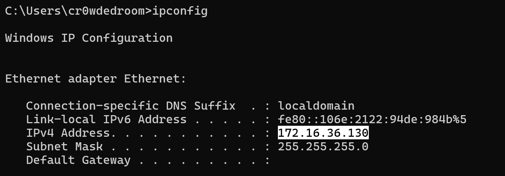  

**Step 1.2: Enable Promiscuous Mode -**  
Promiscuous mode is used for full visibility, so I enabled it using `sudo ip link set eth0 promisc on` and checked using command `ip add show eth0`.  

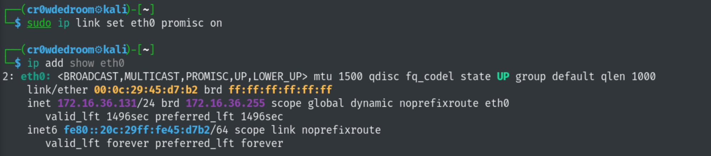  

**Step 1.3: Install Snort -**  
Snort was already installed on Kali VM.  

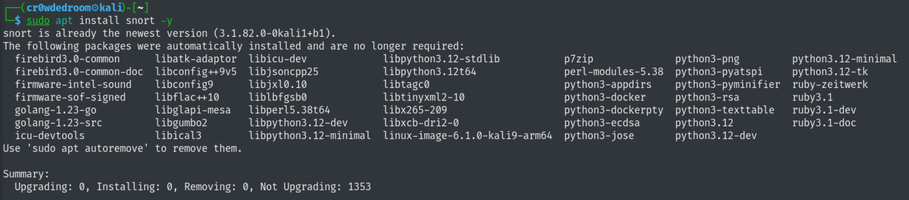  

---  
Phase 2: NIDS Configuration (Snort Setup)  
---
Configured Snort using confirmed IPs and added the custom detection logic.  

**Step 2.1: Define HOME_NET and Configure Snort -**  
Set `HOME_NET` to my subnet i.e, `172.16.36.0/24` and included the custom.rules file to load for detection.  

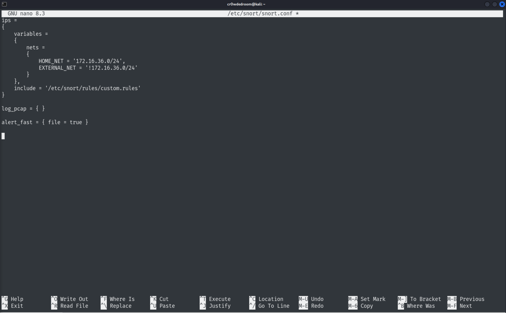  

**Step 2.2: Create Custom Rules -**  
Created rules to detect attempts like Web shell Upload, Aggressive Port Scan & SYN Flood (DoS).  

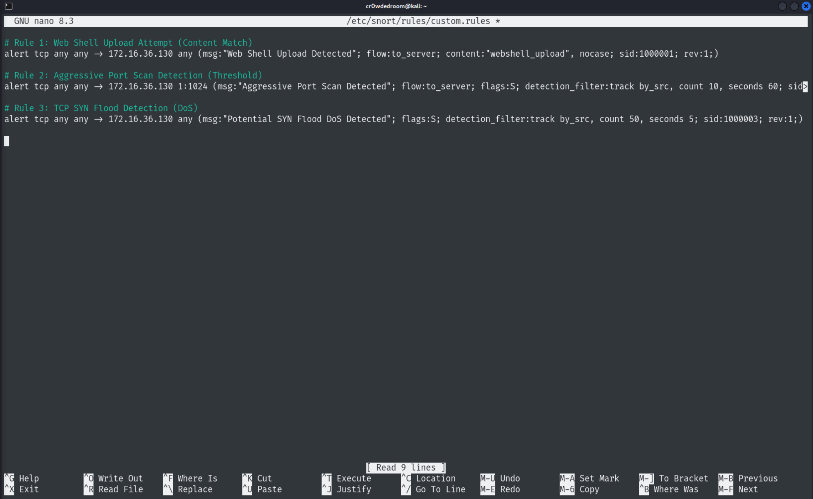  

**Step 2.3: Test Configuration -**  
Ran a test to ensure Snort can load configuration and rules without errors.  

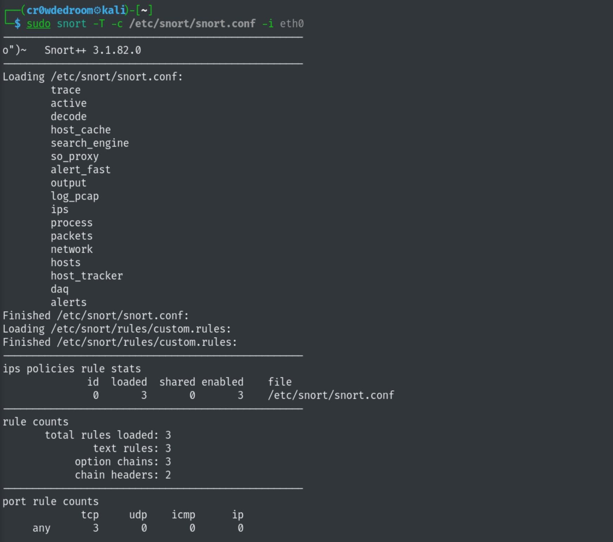  
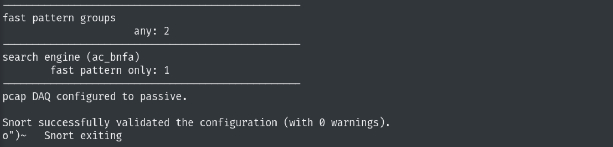  

---  
Phase 3: Threat Simulation & Alerting  
---
Triggered Alerts using custom rules and saved them in a log file on Kali VM.  

**Step 3.1: Start Snort in Loggin Mode -**  
Executed Snort with parameter `-k none` to ignore checksums and `-L` to log in PCAP format in the `/var/log/snort` directory.  

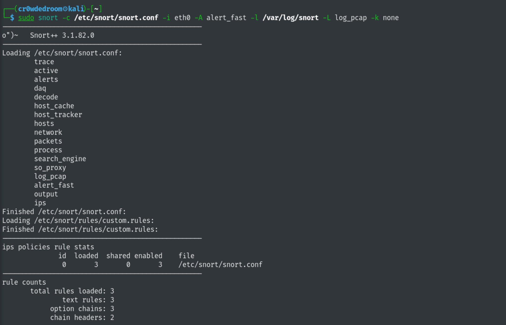  

**Step 3.2: Execute Rule 1 Simulation (Web Shell Content) -**  
The `nping` command was used to craft a custom TCP packet containing the specific string "webshell_upload" in its payload to trigger the signature-based detection rule.  

  

**Step 3.3: Execute Rule 2 Simulation (Aggressive Port Scan) -**  
The `nmap` command was executed to rapidly scan ports 1 through 20, exceeding the threshold of 10 connection attempts per minute required to trip the reconnaissance alert.  

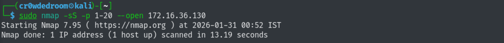  

**Step 3.4: Execute Rule 3 Simulation (SYN Flood) -**  
The `hping3` command sent a rapid-fire "storm" of 100 SYN packets at 1ms intervals to overwhelm the target and validate the rate-limiting detection for Denial of Service attacks.  

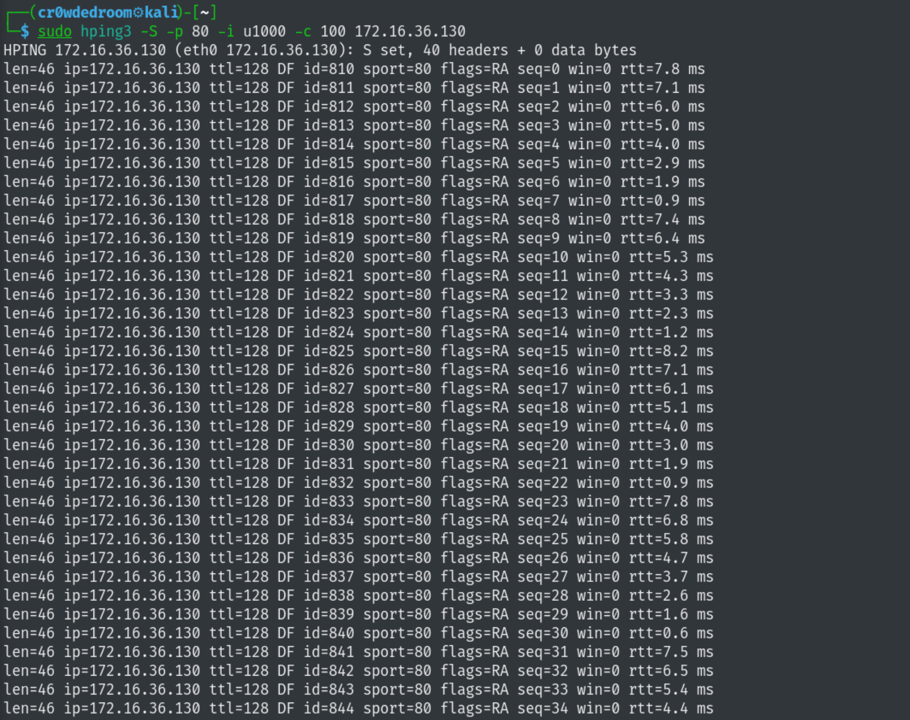  

**Step 3.5: Stop Snort and Check for log file -**  
Checked for the generated PCAP log file in `/var/log/snort` directory.
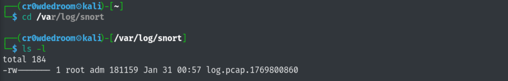  

---  
Phase 4: Packet Analysis & Triage  
---
Used Wireshark to perform PCAP (Packet Analysis) on raw network traffic to confirm the Snort alerts are True Positives.  

**Step 4.1: Filter Rule 1 (Web Shell Content) -**  
The payload was identified by applying a `tcp contains "webshell"` filter and using the Follow TCP Stream tool to reveal the plaintext "webshell_upload" string within the packet data.  

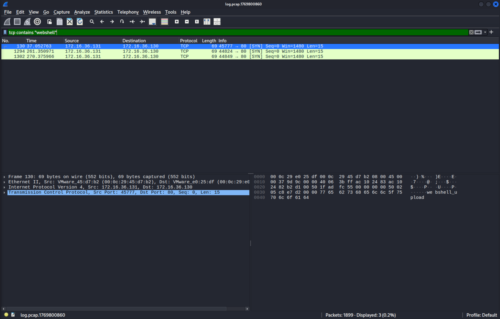  
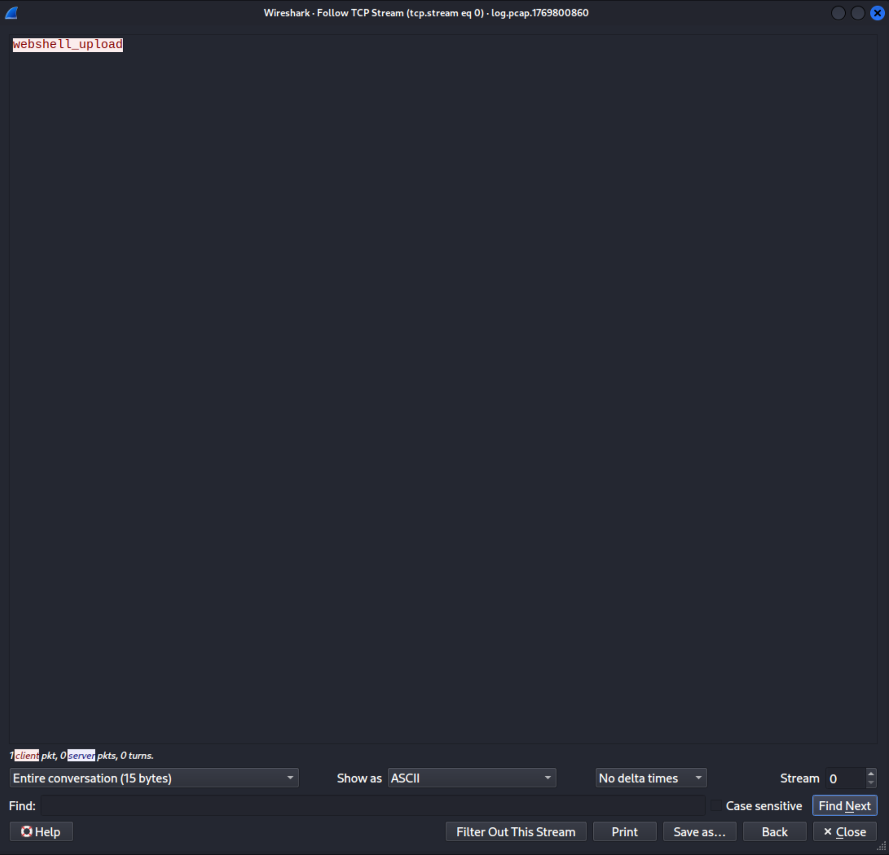  

**Step 4.2: Filter Rule 2 (Aggressive Port Scan) -**  
The attack was confirmed using the Wireshark Flow Graph, which visually captured a rapid "waterfall" of SYN packets originating from the `Kali IP (172.16.36.131)` and targeting a sequential range of ports on the `Windows Host (172.16.36.130)`.  

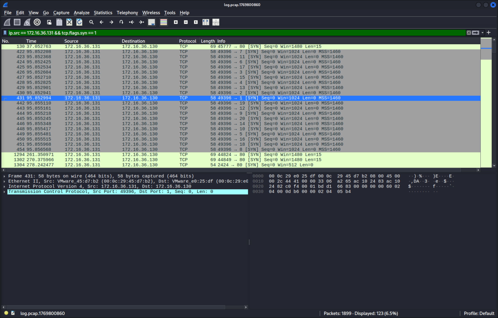  
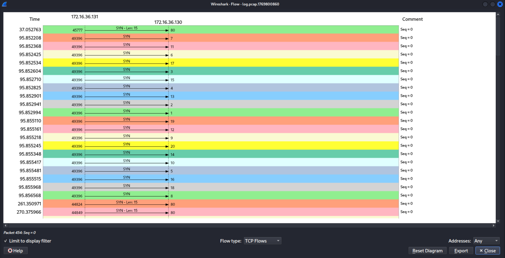  

**Step 4.3: Filter Rule 3 (SYN Flood) -**  
The DoS attack was visualized using the I/O Graph tool, which displayed a massive, vertical spike in traffic volume corresponding to the 100 SYN packets sent by the `hping3` utility.  

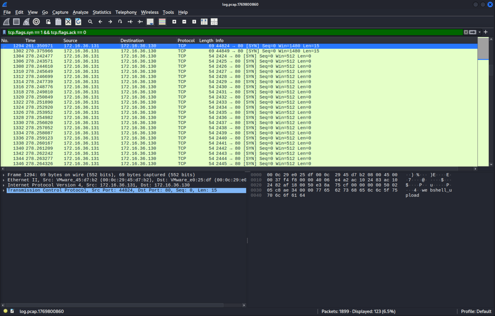  
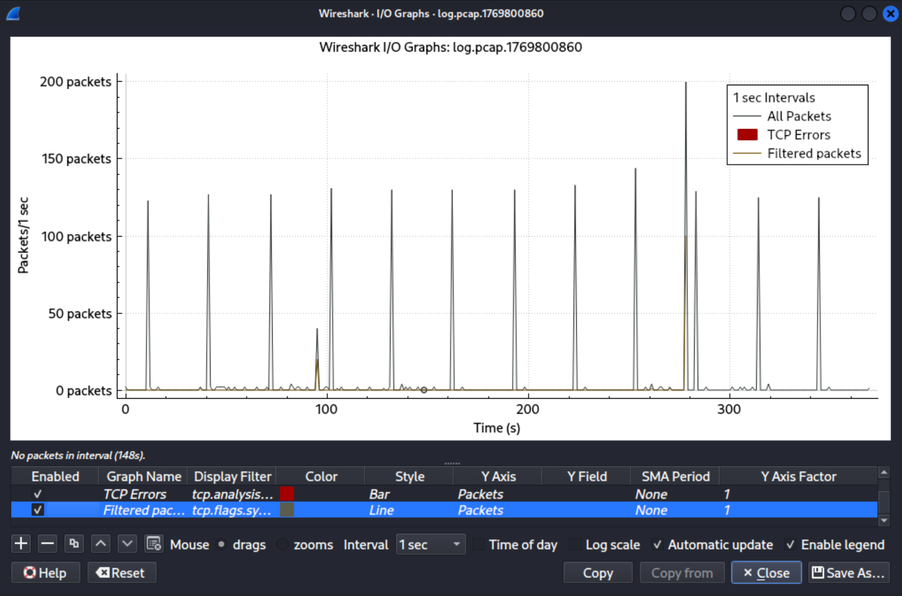  

---  
