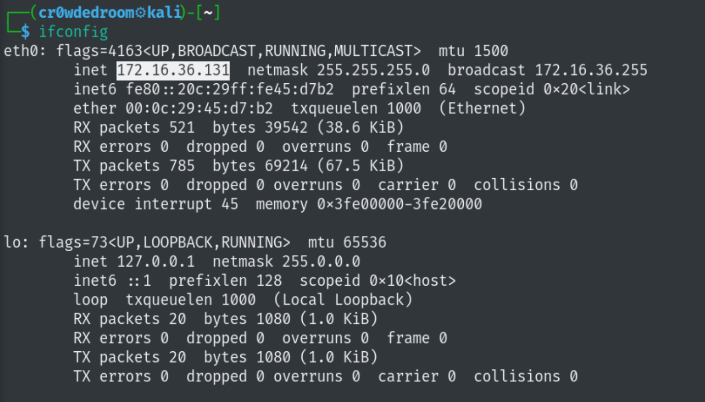

# NIDS-Triage-Lab

This Lab demonstrates end-to-end proficiency in Network Security Monitoring and Incident Triage. The core objective was to build a functional Intrusion Detection System (IDS) and validate its findings. This involved:  
1) Setting up a two-VM network environment (Kali Linux and Windows 11 ARM) with the NIDS monitoring all traffic via Promiscuous Mode.  
2) Configuring Snort to utilize custom rule sets, including content-based and threshold-based detection logic.  
3) Simulating targeted threats (e.g., web shell upload, port scanning) to generate security alerts.  
4) Performing SOC triage by utilizing Wireshark for PCAP analysis to confirm alerts as True Positives, successfully bridging the gap between detection tool output and raw network evidence.

---
Phase 1: Environment Setup and Network Preparation  
---
Ensured Kali VM is correctly configured to see all network traffic and it is on same network interface with Windows VM.  

**Step 1.1: VM IP Address Confirmation**  

**Step 1.2: Enable Promiscuous Mode**  
**Step 1.3: Install Snort and Verify Interface**  

---  
Phase 2: NIDS Configuration (Snort Setup)  
---
Configured Snort using confirmed IPs and added the custom detection logic.  
**Step 2.1: Define HOME_NET and Configure Snort**  
**Step 2.2: Create Custom Rules**  
**Step 2.3: Test Configuration**  

---  
Phase 3: Threat Simulation & Alerting  
---
Triggered Alerts using custom rules and saved them in a log file on Kali VM.  
**Step 3.1: Start Snort in Loggin Mode**  
**Step 3.2: Execute Rule 1 Simulation (Web Shell Content)**  
**Step 3.3: Execute Rule 2 Simulation (Aggressive Port Scan)**  
**Step 3.4: Execute Rule 3 Simulation (SYN Flood)**  
**Step 3.5: Stop Snort and Check for log file**  

---  
Phase 4: Packet Analysis & Triage  
---
Used Wireshark to perform PCAP (Packet Analysis) on raw network traffic to confirm the Snort alerts are True Positives.  
**Step 4.1: Packet Analysis with Wireshark**  
**Step 4.2: Filter Rule 1 (Web Shell Content)**  
**Step 4.3: Filter Rule 2 (Aggressive Port Scan)**  
**Step 4.4: Filter Rule 3 (SYN Flood)**  

---  
